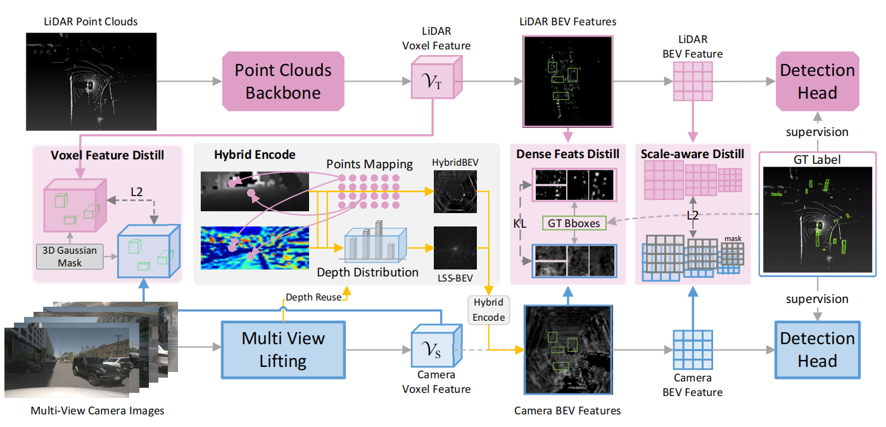

"# HybridBEV" 

The official implementation of the paper [HybirdBEV: Hybrid Encode and Distillation for Improved BEV 3D Object Detection]



# Dataset Preparation

## Dataset structure

It is recommended to symlink the dataset root to `$data`.
If your folder structure is different from the following, you may need to change the corresponding paths in config files.

```
HybirdBEV
├── mmdet3d
├── tools
├── configs
├── projects
├── data
│   ├── nuscenes
│   │   ├── maps
│   │   ├── samples
│   │   ├── sweeps
│   │   ├── v1.0-test
|   |   ├── v1.0-trainval
```

# Prerequisites
HybirdBEV is developed with the following version of modules.
- Linux or macOS (Windows is not currently officially supported)
- Python 3.7
- PyTorch 1.10.0
- CUDA 11.3.1
- GCC 7.3.0
- MMCV==1.3.14
- MMDetection==2.14.0
- MMSegmentation==0.14.1

# Installation

**a. Create a conda virtual environment and activate it.**

```shell
conda create -n hybird python=3.7 -y
conda activate hybird
```

**b. Install PyTorch and torchvision following the [official instructions](https://pytorch.org/).**

```shell
conda install pytorch==1.10.0 torchvision==0.11.1 torchaudio==0.10.0 cudatoolkit=11.3 -c pytorch
```

**c. Install [MMCV](https://mmcv.readthedocs.io/en/latest/), [MMDetection](https://github.com/open-mmlab/mmdetection), [MMSegmentation](https://github.com/open-mmlab/mmsegmentation), and other requirements.**

```shell
pip install -r requirements.txt
```